# 0. 全域機制

## 1. 時序圖

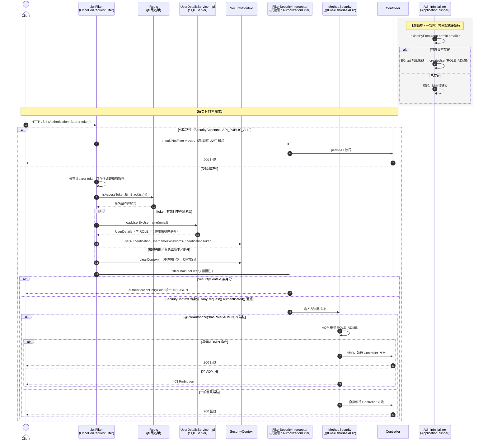
```mermaid
sequenceDiagram
    autonumber
    actor Client as Client
    participant JwtFilter as JwtFilter<br/>(OncePerRequestFilter)
    participant Redis as Redis<br/>(jti 黑名單)
    participant UDS as UserDetailsServiceImpl<br/>(SQL Server)
    participant SC as SecurityContext
    participant Authz as FilterSecurityInterceptor<br/>(授權層 / AuthorizationFilter)
    participant MS as MethodSecurity<br/>(@PreAuthorize AOP)
    participant Ctrl as Controller
    participant Init as AdminInitializer<br/>(ApplicationRunner)

    rect rgba(180, 180, 180, 0.15)
        Note over Init: 【啟動時・一次性】容器就緒後執行
        Init->>Init: existsByEmail(app.admin.email)?
        alt 管理員不存在
            Init->>Init: BCrypt 加密密碼 → createUser(ROLE_ADMIN)
        else 已存在
            Init-->>Init: 略過，防重複建立
        end
    end

    Note over Client, Ctrl: 【每次 HTTP 請求】
    Client->>JwtFilter: HTTP 請求 (Authorization: Bearer token)

    alt 公開路徑（SecurityConstants.API_PUBLIC_ALL）
        JwtFilter->>Authz: shouldNotFilter = true，整個跳過 JWT 驗證
        Authz->>Ctrl: permitAll 放行
        Ctrl-->>Client: 200 回應
    else 受保護路徑
        JwtFilter->>JwtFilter: 檢查 Bearer token 存在性與簽章有效性
        JwtFilter->>Redis: isAccessTokenJtiInBlacklist(jti)
        Redis-->>JwtFilter: 黑名單查詢結果

        alt token 有效且不在黑名單
            JwtFilter->>UDS: loadUserByUsername(email)
            UDS-->>JwtFilter: UserDetails（含 ROLE_*；停用帳號拋例外）
            JwtFilter->>SC: setAuthentication(UsernamePasswordAuthenticationToken)
        else 驗證失敗／黑名單命中／例外
            JwtFilter->>SC: clearContext()（不直接回錯，照常放行）
        end

        JwtFilter->>Authz: filterChain.doFilter() 繼續往下

        alt SecurityContext 無身分
            Authz-->>Client: authenticationEntryPoint 統一 401 JSON
        else SecurityContext 有身分（anyRequest().authenticated() 通過）
            Authz->>MS: 進入方法層授權
            alt @PreAuthorize("hasRole('ADMIN')") 端點
                MS->>MS: AOP 驗證 ROLE_ADMIN
                alt 具備 ADMIN 角色
                    MS->>Ctrl: 通過，執行 Controller 方法
                    Ctrl-->>Client: 200 回應
                else 非 ADMIN
                    MS-->>Client: 403 Forbidden
                end
            else 一般會員端點
                MS->>Ctrl: 直接執行 Controller 方法
                Ctrl-->>Client: 200 回應
            end
        end
    end
```

## 2. 重點解釋

本機制為全系統的安全性基礎，採用 JWT 結合 Redis 黑名單實現無狀態身分驗證與三層式授權架構。

- **啟動階段**：
  - 容器就緒後由 `AdminInitializer` (ApplicationRunner) 自動執行一次性初始化。
  - 呼叫 `existsByEmail` 檢查管理員帳號是否存在，若不存在則使用 BCrypt 加密密碼並調用 `createUser(ROLE_ADMIN)` 落庫，若已存在則略過以防重複建立。
- **請求驗證流程 (JwtFilter 核心六步鏈)**：
  - **步驟一**：`JwtFilter` 攔截 HTTP 請求，若為 `SecurityConstants.API_PUBLIC_ALL` 白名單路徑，則 `shouldNotFilter` 回傳 true 直接跳過驗證。
  - **步驟二**：若為受保護路徑，檢查 HTTP 標頭 `Authorization: Bearer token` 是否存在與其簽章有效性。
  - **步驟三**：解析 JWT 中的 `jti` 宣告，並向 Redis 查詢 `isAccessTokenJtiInBlacklist(jti)`。
  - **步驟四**：若 Token 有效且不在黑名單中，調用 `UserDetailsServiceImpl.loadUserByUsername(email)` 從資料庫載入最新狀態。
  - **步驟五**：如驗證無誤，將使用者資訊封裝為 `UsernamePasswordAuthenticationToken` 寫入 `SecurityContext`。
  - **步驟六**：若上述任一步驟驗證失敗或拋出例外，均調用 `SecurityContext.clearContext()` 清除身分後照常放行。
- **授權判定流程**：
  - **白名單路徑**：由 `FilterSecurityInterceptor` 透過 `permitAll()` 直接放行。
  - **無身分請求**：若 `SecurityContext` 為空且請求非白名單，由 `authenticationEntryPoint` 攔截並統一輸出 401 JSON 錯誤。
  - **受保護路徑 (會員/管理員)**：通過基本驗證者進入方法層 (Method Security)，AOP 攔截並比對 `@PreAuthorize("hasRole('ADMIN')")`，具備 `ADMIN` 角色者放行至 Controller，否則返回 403 Forbidden。

# 1. 帳號認證

## 1. 時序圖

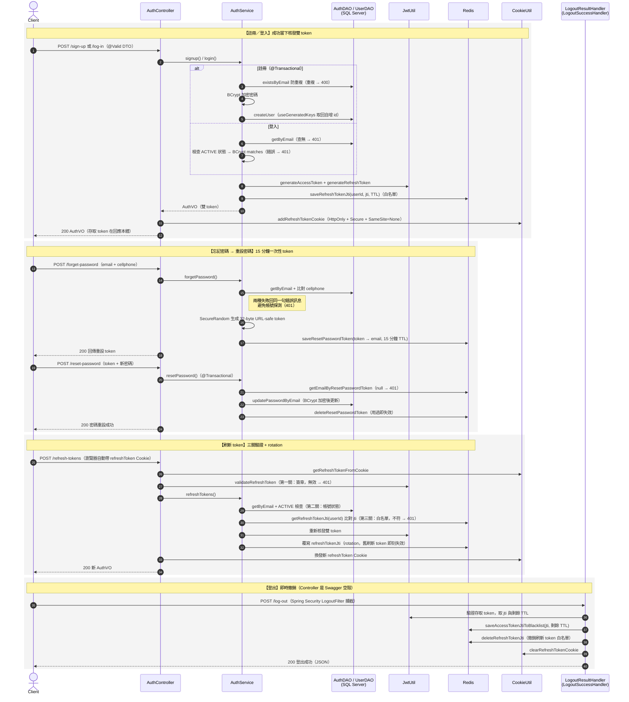
```mermaid
sequenceDiagram
    autonumber
    actor Client as Client
    participant Ctrl as AuthController
    participant Svc as AuthService
    participant DB as AuthDAO / UserDAO<br/>(SQL Server)
    participant Jwt as JwtUtil
    participant Redis as Redis
    participant Cookie as CookieUtil
    participant Logout as LogoutResultHandler<br/>(LogoutSuccessHandler)

    rect rgba(180, 180, 180, 0.15)
        Note over Client, Cookie: 【註冊／登入】成功當下核發雙 token
        Client->>Ctrl: POST /sign-up 或 /log-in（@Valid DTO）
        Ctrl->>Svc: signup() / login()
        alt 註冊（@Transactional）
            Svc->>DB: existsByEmail 防重複（重複 → 400）
            Svc->>Svc: BCrypt 加密密碼
            Svc->>DB: createUser（useGeneratedKeys 取回自增 id）
        else 登入
            Svc->>DB: getByEmail（查無 → 401）
            Svc->>Svc: 檢查 ACTIVE 狀態 → BCrypt matches（錯誤 → 401）
        end
        Svc->>Jwt: generateAccessToken + generateRefreshToken
        Svc->>Redis: saveRefreshTokenJti(userId, jti, TTL)（白名單）
        Svc-->>Ctrl: AuthVO（雙 token）
        Ctrl->>Cookie: addRefreshTokenCookie（HttpOnly + Secure + SameSite=None）
        Ctrl-->>Client: 200 AuthVO（存取 token 在回應本體）
    end

    rect rgba(180, 180, 180, 0.15)
        Note over Client, Redis: 【忘記密碼 → 重設密碼】15 分鐘一次性 token
        Client->>Ctrl: POST /forget-password（email + cellphone）
        Ctrl->>Svc: forgetPassword()
        Svc->>DB: getByEmail + 比對 cellphone
        Note right of Svc: 兩種失敗回同一句錯誤訊息<br/>避免帳號探測（401）
        Svc->>Svc: SecureRandom 生成 32-byte URL-safe token
        Svc->>Redis: saveResetPasswordToken(token → email, 15 分鐘 TTL)
        Ctrl-->>Client: 200 回傳重設 token
        Client->>Ctrl: POST /reset-password（token + 新密碼）
        Ctrl->>Svc: resetPassword()（@Transactional）
        Svc->>Redis: getEmailByResetPasswordToken（null → 401）
        Svc->>DB: updatePasswordByEmail（BCrypt 加密後更新）
        Svc->>Redis: deleteResetPasswordToken（用過即失效）
        Ctrl-->>Client: 200 密碼重設成功
    end

    rect rgba(180, 180, 180, 0.15)
        Note over Client, Redis: 【刷新 token】三關驗證 + rotation
        Client->>Ctrl: POST /refresh-tokens（瀏覽器自動帶 refreshToken Cookie）
        Ctrl->>Cookie: getRefreshTokenFromCookie
        Ctrl->>Jwt: validateRefreshToken（第一關：簽章，無效 → 401）
        Ctrl->>Svc: refreshTokens()
        Svc->>DB: getByEmail + ACTIVE 檢查（第二關：帳號狀態）
        Svc->>Redis: getRefreshTokenJti(userId) 比對 jti（第三關：白名單，不符 → 401）
        Svc->>Jwt: 重新核發雙 token
        Svc->>Redis: 覆寫 refreshTokenJti（rotation，舊刷新 token 即刻失效）
        Ctrl->>Cookie: 換發新 refreshToken Cookie
        Ctrl-->>Client: 200 新 AuthVO
    end

    rect rgba(180, 180, 180, 0.15)
        Note over Client, Logout: 【登出】即時撤銷（Controller 是 Swagger 空殼）
        Client->>Logout: POST /log-out（Spring Security LogoutFilter 攔截）
        Logout->>Jwt: 驗證存取 token，取 jti 與剩餘 TTL
        Logout->>Redis: saveAccessTokenJtiToBlacklist(jti, 剩餘 TTL)
        Logout->>Redis: deleteRefreshTokenJti（撤銷刷新 token 白名單）
        Logout->>Cookie: clearRefreshTokenCookie
        Logout-->>Client: 200 登出成功（JSON）
    end
```

## 2. 重點解釋

本模組提供使用者登入、登出、權杖刷新與密碼重設的完整生命週期管理，並透過雙 Token 機制與 Token Rotation 設計維護連線安全。

- **註冊與登入流程**：
  - 客戶端發送註冊或登入請求，若是註冊則檢查 Email 是否重複，並使用 BCrypt 加密密碼後寫入資料庫取得自增 id。
  - 成功後核發雙 Token，將 Access Token 放入回應本體，並將 Refresh Token 的 `jti` 以 `userId` 為鍵值存入 Redis 白名單。
  - 呼叫 `CookieUtil` 將 Refresh Token 寫入瀏覽器的 HttpOnly、Secure 且 SameSite=None 的 Cookie 中以防範 XSS 攻擊。
- **權杖刷新流程 (Token Rotation)**：
  - 客戶端調用 `/refresh-tokens` 請求，由瀏覽器自動帶上 Refresh Token Cookie。
  - 依序進行三關驗證：確認權杖簽章有效性、檢查資料庫中帳號狀態是否為 `ACTIVE`、比對 Redis 白名單中該 `userId` 對應的 `jti` 是否一致。
  - 驗證通過後重新核發雙 Token，並以新 `jti` 覆寫 Redis 白名單以完成 rotation，使得舊的 Refresh Token 立即失效。
- **忘記與重設密碼流程**：
  - 客戶端發送忘記密碼請求，後端同時驗證 Email 與手機號碼一致性（兩者任一失敗皆回傳相同錯誤文案以防帳號探測）。
  - 通過後使用 `SecureRandom` 生成 32 位元組的 URL-Safe Token，並以 Email 為值存入 Redis 設定 15 分鐘 TTL。
  - 用戶帶上重設 Token 與新密碼提交，後端驗證 Redis 中的 Token 有效後以 BCrypt 加密更新至資料庫，並立即刪除該重設 Token。
- **登出流程**：
  - 客戶端發送登出請求，由 Spring Security `LogoutFilter` 攔截，交由 `LogoutResultHandler` 處理（Controller 僅為 Swagger 文件空殼）。
  - 解析當前 Access Token，將其 `jti` 與剩餘 TTL 寫入 Redis 黑名單以封鎖該存取權杖，並刪除 Redis 白名單中的 Refresh Token。
  - 調用 `CookieUtil` 清除客戶端的 Refresh Token Cookie，實現無狀態架構下的「即時登出撤銷」。

# 2. ✨ 臺北捷運資訊

## 1. 時序圖

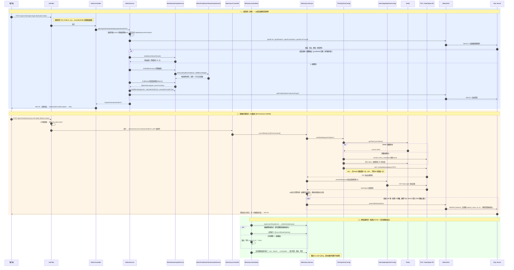
```mermaid
sequenceDiagram
    autonumber
    participant Client as 客戶端
    participant Filter as JwtFilter
    participant MC as MetroController
    participant MS as MetroService
    participant RG as MetroRouteGraphService
    participant FB as MetroForkBranchRouteGraphService
    participant MSC as MetroSyncController
    participant SCH as MetroSyncScheduler
    participant SS as MetroSyncService
    participant TDXC as TDXApiClientConfig
    participant DTC as DataTaipeiApiClientConfig
    participant Redis as Redis
    participant EXT as TDX / DataTaipei API
    participant DAO as MetroDAO
    participant DB as SQL Server

    rect rgb(230, 240, 255)
    Note over Client, DB: 一、公開查詢（訪客）— 以起訖站路徑查詢為例
    Client->>Filter: POST /api/v1/metro/get-origin-destination-detail
    Note right of Filter: 路徑列於 API_PUBLIC_ALL，shouldNotFilter 直接跳過驗證
    Filter->>MC: 放行
    MC->>MS: getOriginDestinationDetail(stationRouteDTO)
    MS->>MS: 驗證票種(1/4/5/7)與路線策略(1/2)，不合法丟 IllegalArgumentException
    MS->>DAO: getAllLine / getAllStation / getAllLineStation / getAllLineTransfer
    DAO->>DB: SELECT 全量路網基礎資料
    DB-->>MS: 路線、車站、關聯、換乘資料
    alt 起訖為同一實體車站（以 stationId 比對，非代碼字串）
        MS->>RG: buildSameStationResult()
        RG-->>MS: 單站結果（票價固定 20 元）
    else 一般情形
        MS->>RG: buildAdjacencyList(策略權重)
        RG->>FB: isSecondaryBranchStation / addBranchEdges
        FB-->>RG: 略過線性推導，改建 Y 字分岔支線邊
        MS->>RG: findRoute(多起點多終點 Dijkstra)
        RG-->>MS: DijkstraResult(path, prevIsTransfer)
        MS->>RG: buildRouteSegments / calculateTotalTime / calculateTransferTime
        MS->>DAO: getFareByStationCodesAndType()
        DAO->>DB: SELECT 兩站票價
    end
    MS-->>MC: OriginDestinationDetailVO
    MC-->>Client: 200 OK（查無車站 → StationNotFoundException → 404）
    end

    rect rgb(255, 245, 230)
    Note over Client, DB: 二、管理員手動同步（6 端點皆 @PreAuthorize ADMIN）
    Client->>Filter: POST /api/v1/metro/sync/sync-all-station (Bearer token)
    Filter->>Filter: 六步驗證鏈 → 寫入 SecurityContext
    Filter->>MSC: 放行 → @PreAuthorize("hasRole('ADMIN')") AOP 驗角色
    MSC->>SS: syncAllStation() [@Transactional]
    SS->>TDXC: sendGetRequest("/Station")
    TDXC->>Redis: getTdxAccessToken()
    alt Redis 快取命中
        Redis-->>TDXC: access token
    else 快取未命中
        TDXC->>EXT: OAuth2 client_credentials 換發 token
        TDXC->>Redis: 存入 token（效期提前 60 秒失效）
    end
    TDXC->>EXT: GET /v2/Rail/Metro/Station/TRTC
    Note right of TDXC: 401 → 清 Redis 快取重發一次；429 → 等待 90 秒重試一次
    EXT-->>SS: TDX 車站名稱資料
    SS->>DTC: sendGetRequest(車站設施資料集 id)
    DTC->>EXT: GET data.taipei 車站設施
    EXT-->>SS: DataTaipei 設施資料
    SS->>SS: 以站名合併雙來源（板橋別名正規化、轉乘站重複站名去重）
    loop 每批 150 筆（每筆 13 參數，避開 SQL Server 單次 2100 參數上限）
        SS->>DAO: upsertAllStation(batch)
        DAO->>DB: MERGE [stations]（比對鍵 original_name_zh_tw，不覆寫管理端改名）
    end
    DB-->>Client: 整批成功才提交，任一失敗整批回滾 → 200 OK
    end

    rect rgb(235, 255, 235)
    Note over SCH, DB: 三、排程自動同步（每週日 23:00 ＋ 首次部署初始化）
    SCH->>SS: ApplicationReadyEvent → isMetroDataEmpty()
    alt 路線資料表為空（首次部署或容器初始化）
        SCH->>SS: 立即執行一次 syncAllDataPipeline()
    else 已有資料（一般重啟）
        SCH->>SCH: 跳過，等待 cron 0 0 23 * * SUN
    end
    SCH->>SS: 依外鍵相依順序執行：Line、Station → LineStation → 累計時間、換乘、票價
    Note right of SS: 整段 try-catch 記 log，單次失敗不影響下次排程
    end
```

## 2. 重點解釋

- **公開捷運路徑查詢流程**：
  - 客戶端發起起訖站查詢，`JwtFilter` 識別路徑在白名單內直接跳過驗證，Controller 調用 `MetroService` 進行參數驗證（如票種與路線策略合法性）。
  - `MetroRouteGraphService` 自資料庫加載全量路網關聯，以多起點多終點**Dijkstra 演算法**解決換乘站在不同路線具多代碼的等價站點尋路問題。
  - 策略 1（最少轉乘）引入巨大的轉乘權重常數（1,000,000）使轉乘次數成為最優先比較標的，車程秒數為次要；Y 字分岔支線由 `MetroForkBranchRouteGraphService` 以人工站序進行輔助建邊。
  - 尋路結束後計算累計時間與換乘時間，並由 DAO 撈取對應票價組裝為 `OriginDestinationDetailVO` 返回。
- **管理員資料同步流程**：
  - 管理員透過同步端點發送請求，經 `JwtFilter` 與方法層 `@PreAuthorize("hasRole('ADMIN')")` 雙重認證後進入 `MetroSyncService`。
  - 從 Redis 讀取 TDX 的 OAuth2 Access Token，若無則由 `TDXApiClientConfig` 向外部 TDX API 請求並快取（提早 60 秒失效以防邊界時間過期）。
  - 同步服務併發調用 TDX（獲取站點與時間）與 DataTaipei（獲取車站設施），並以 `original_name_zh_tw` 作為資料合併對照鍵以保護管理端的手動站名修改。
  - 在 `@Transactional` 管理下以 150 筆為一批次執行 MERGE 寫入 SQL Server，避免單次寫入超過資料庫 2100 個參數的上限，整批成功始提交。
  - 外部 API 連線設有防禦機制
    - 遇到 401 狀態碼則清空快取重試
    - 429 則自動退避等待 90 秒
    - 票價 API 分頁請求間進行節流控制以防流量超限

# 3. 會員

> 對應用例：**UC_A 修改個人資料**、**UC_B 變更密碼**（一般會員）；**UC_C 查詢會員名單**、**UC_D 啟用停用會員帳號**（管理員）。
> 檔案：`UserController.java`、`UserService.java`、`UserDAO.java`、`mappers/UserMapper.xml`

## 1. 時序釐清與盲點審查

### 1.1 動態執行順序與依賴關係

- **共同前置——登入**：四個用例都必須先完成帳號認證，由 `JwtFilter` 六步驗證鏈把身分寫入 SecurityContext。UC_A／UC_B 到此即可通行（會員層 `anyRequest().authenticated()`）；UC_C／UC_D 還要再過方法層 `@PreAuthorize("hasRole('ADMIN')")`（`UserController:91、201`）這第二道防線。
- **UC_A ⟂ UC_B——互相獨立**：修改個資與變更密碼無先後順序，可任意穿插。兩者共用同一套防越權骨架：`getAuthenticatedEmail()`（`UserService:235-237`，身分一律取自 SecurityContextHolder、不收前端 userId）→ `getByEmail` 存在檢查 → DAO 更新，全部掛 `@Transactional`。
- **UC_C → UC_D——資料依賴**：`update-status` 的輸入 `userId` 實務上來自 `get-all-user` 回傳的 `UserVO.id`，管理員必然「先查名單、再停權」。這是操作上的前置條件而非同一次執行內的行為相依，正好呼應 use case 圖「前置條件不畫 include/extend」的記法取捨。
- **UC_D → 終結目標會員的所有後續用例——跨用例副作用**：停權寫入 DB 並刪除 Redis 刷新 token 白名單後，被停權者下一次任何請求（含 UC_A／UC_B）會在 `JwtFilter` → `UserDetailsServiceImpl:44-47` 的每請求 DB 重載被擋（拋例外 → SecurityContext 清空 → 統一 401），`/refresh-tokens` 也因白名單已刪而無法換發。UC_D 是四者中唯一會改變其他用例可達性的操作。
- **UC_A 內部順序——升級副作用不可對調**：`updateBirthDate` 先寫出生日期、再於同一交易內嘗試升級 PREMIUM（`UserService:162-164`），順序固定——升級 SQL 的 `WHERE birth_date IS NOT NULL` 依賴前一步已落庫。

### 1.3 Coding style 一致性判定

**遵守的部分**：建構子注入、SLF4J 日誌、DTO 進／VO 出、`@Valid` + Jakarta Validation 入口驗證、五個寫入方法皆 `@Transactional`（`UserService:107-228`）、Swagger 標註完整、`UpdatePasswordDTO.toString` 遮罩密碼、例外統一交 `GlobalExceptionHandler` 分流（404／401／403）、時間一律以 UTC 存取——與帳號認證、捷運模組的既有款式一致。

**待修改處**，按重要性排序：

| #   | 位置                             | 問題                                                                                                                                                                                                 | 修改建議                                                                                                            |
| --- | -------------------------------- | ---------------------------------------------------------------------------------------------------------------------------------------------------------------------------------------------------- | ------------------------------------------------------------------------------------------------------------------- |
| 1   | `UserDAO:35` vs `UserMapper.xml` | **【死碼＋潛在執行期錯誤】**介面宣告 `getAll()` 但 XML 沒有對應的 statement，全案也無人呼叫；一旦被呼叫會拋 MyBatis `BindingException`                                                               | 直接刪除該方法；若日後需要再連同 XML 一起補                                                                         |
| 2   | `UserService:129-144`            | **【安全盲點】變更密碼後未撤銷既有 token**——存取 token 仍有效、刷新 token 白名單未刪，其他裝置的 session 不會被踢下線；系統已有現成的 `deleteRefreshTokenJti`（`updateStatus:223` 就有串），此處漏接 | 密碼更新成功後呼叫 `redisService.deleteRefreshTokenJti(user.getId().toString())`，強制其他裝置重新登入              |
| 3   | `UserController:93-96`           | `page`／`size` 無驗證：`size=0` 時 `totalPages` 除以零（`Math.ceil` → Infinity 再窄化轉型）且 SQL Server `FETCH NEXT 0 ROWS` 為語法錯誤 → 500；負數同理                                              | 參數加 `@Min(0)`（page）、`@Min(1)`（size），讓錯誤走 400 分流                                                      |
| 4   | `UserFilterRequestDTO` 全檔      | 全案無任何引用（`getAllUser` 以 `@RequestParam` 收 keyword，未用此 DTO），死碼                                                                                                                       | 刪除檔案                                                                                                            |
| 5   | `UserMapper.xml:61-67`           | 升級守門條件 `membership_tier_id != #{membershipTierId}`：現只有 BASIC／PREMIUM 兩級無礙，但未來若新增更高等級，填生日會被此 SQL「降級」回 PREMIUM                                                   | 條件改為 `membership_tier_id < #{membershipTierId}`（或明確 `= BASIC 的 id`），語意從「不同就改」收斂為「只升不降」 |
| 6   | `UserDAO` 全檔                   | 8 格縮排，與專案 4 格不一致（同 `AuthDAO`、`MetroDAO` 已列問題，DAO 層通病）                                                                                                                         | 統一 4 格，以 formatter 設定固定                                                                                    |
| 7   | `UserService:35`                 | 類別 Javadoc 寫「處理使用者資料**查詢**相關的業務邏輯」，實際包含五個更新方法，註解與職責不符                                                                                                        | 修正為「處理使用者資料查詢與更新相關的業務邏輯」                                                                    |
| 8   | `UserMapper.xml:19、31`          | 模糊搜尋的 keyword 未跳脫 `%` 與 `_` 萬用字元，使用者輸入會改變搜尋語意（`#{}` 已參數化、無注入風險，僅語意問題）                                                                                    | LIKE 加 `ESCAPE` 處理，或於文件註明此為預期行為                                                                     |
| 9   | `UserController:198`             | `update-status` 的 403 Swagger 只寫「權限不足」，漏了「不得變更管理員帳號狀態」（`AdminStatusModificationException` → 403，`GlobalExceptionHandler:187`）也是同一狀態碼                              | 403 說明補充兩種情境                                                                                                |

## 2. 各 Use Case 時序圖

### UC_A 修改個人資料（update-username／update-birth-date／update-cellphone）

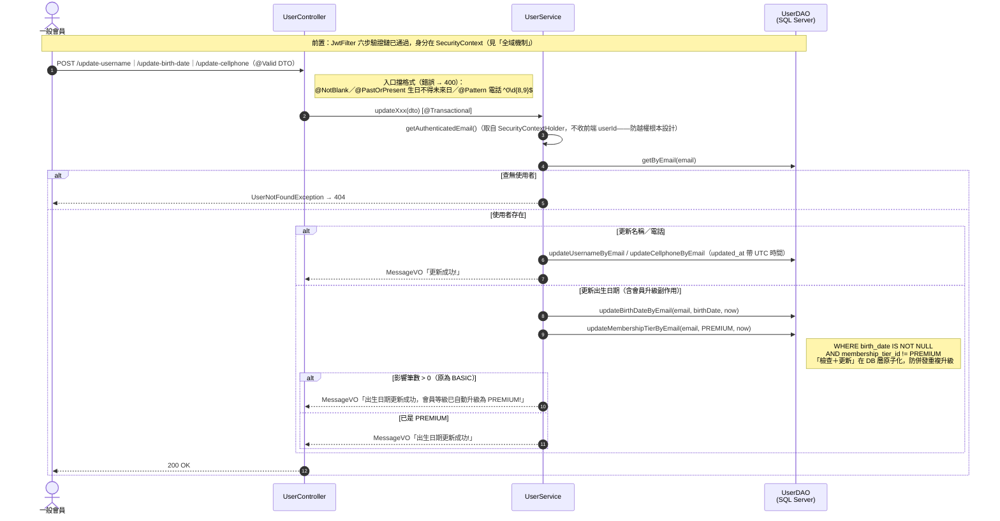
```mermaid
sequenceDiagram
    autonumber
    actor Member as 一般會員
    participant Ctrl as UserController
    participant Svc as UserService
    participant DAO as UserDAO<br/>(SQL Server)

    Note over Member, DAO: 前置：JwtFilter 六步驗證鏈已通過，身分在 SecurityContext（見「全域機制」）
    Member->>Ctrl: POST /update-username｜/update-birth-date｜/update-cellphone（@Valid DTO）
    Note right of Ctrl: 入口擋格式（錯誤 → 400）：<br/>@NotBlank／@PastOrPresent 生日不得未來日／@Pattern 電話 ^0\d{8,9}$
    Ctrl->>Svc: updateXxx(dto) [@Transactional]
    Svc->>Svc: getAuthenticatedEmail()（取自 SecurityContextHolder，不收前端 userId——防越權根本設計）
    Svc->>DAO: getByEmail(email)
    alt 查無使用者
        Svc-->>Member: UserNotFoundException → 404
    else 使用者存在
        alt 更新名稱／電話
            Svc->>DAO: updateUsernameByEmail / updateCellphoneByEmail（updated_at 帶 UTC 時間）
            Svc-->>Ctrl: MessageVO「更新成功!」
        else 更新出生日期（含會員升級副作用）
            Svc->>DAO: updateBirthDateByEmail(email, birthDate, now)
            Svc->>DAO: updateMembershipTierByEmail(email, PREMIUM, now)
            Note right of DAO: WHERE birth_date IS NOT NULL<br/>AND membership_tier_id != PREMIUM<br/>「檢查＋更新」在 DB 層原子化，防併發重複升級
            alt 影響筆數 > 0（原為 BASIC）
                Svc-->>Ctrl: MessageVO「出生日期更新成功，會員等級已自動升級為 PREMIUM!」
            else 已是 PREMIUM
                Svc-->>Ctrl: MessageVO「出生日期更新成功!」
            end
        end
        Ctrl-->>Member: 200 OK
    end
```

### UC_B 變更密碼（update-password）

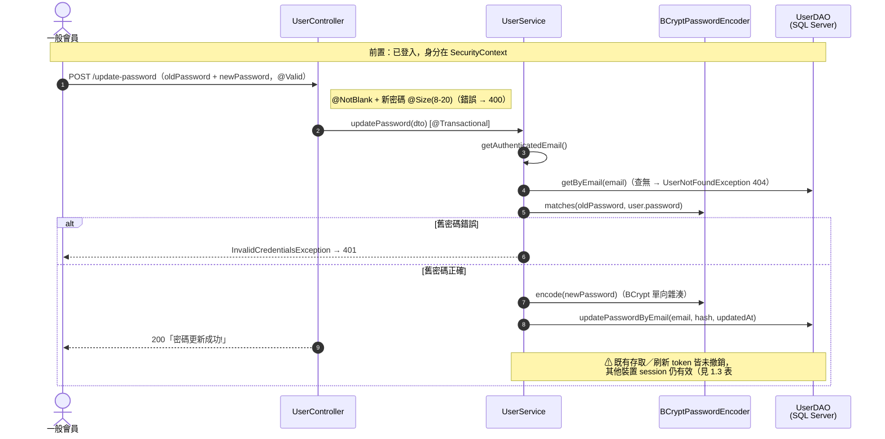
```mermaid
sequenceDiagram
    autonumber
    actor Member as 一般會員
    participant Ctrl as UserController
    participant Svc as UserService
    participant Enc as BCryptPasswordEncoder
    participant DAO as UserDAO<br/>(SQL Server)

    Note over Member, DAO: 前置：已登入，身分在 SecurityContext
    Member->>Ctrl: POST /update-password（oldPassword + newPassword，@Valid）
    Note right of Ctrl: @NotBlank + 新密碼 @Size(8-20)（錯誤 → 400）
    Ctrl->>Svc: updatePassword(dto) [@Transactional]
    Svc->>Svc: getAuthenticatedEmail()
    Svc->>DAO: getByEmail(email)（查無 → UserNotFoundException 404）
    Svc->>Enc: matches(oldPassword, user.password)
    alt 舊密碼錯誤
        Svc-->>Member: InvalidCredentialsException → 401
    else 舊密碼正確
        Svc->>Enc: encode(newPassword)（BCrypt 單向雜湊）
        Svc->>DAO: updatePasswordByEmail(email, hash, updatedAt)
        Ctrl-->>Member: 200「密碼更新成功!」
        Note over Svc, DAO: ⚠ 既有存取／刷新 token 皆未撤銷，<br/>其他裝置 session 仍有效（見 1.3 表 #2）
    end
```

### UC_C 查詢會員名單（get-all-user）

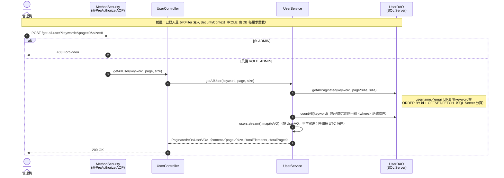
```mermaid
sequenceDiagram
    autonumber
    actor Admin as 管理員
    participant MS as MethodSecurity<br/>(@PreAuthorize AOP)
    participant Ctrl as UserController
    participant Svc as UserService
    participant DAO as UserDAO<br/>(SQL Server)

    Note over Admin, DAO: 前置：已登入且 JwtFilter 寫入 SecurityContext（ROLE 由 DB 每請求重載）
    Admin->>MS: POST /get-all-user?keyword=&page=0&size=8
    alt 非 ADMIN
        MS-->>Admin: 403 Forbidden
    else 具備 ROLE_ADMIN
        MS->>Ctrl: getAllUser(keyword, page, size)
        Ctrl->>Svc: getAllUser(keyword, page, size)
        Svc->>DAO: getAllPaginated(keyword, page*size, size)
        Note right of DAO: username／email LIKE '%keyword%'<br/>ORDER BY id + OFFSET/FETCH（SQL Server 分頁）
        Svc->>DAO: countAll(keyword)（與列表共用同一組 <where> 過濾條件）
        Svc->>Svc: users.stream().map(toVO)（轉 UserVO，不含密碼；時間補 UTC 時區）
        Svc-->>Ctrl: PaginatedVO<UserVO>（content／page／size／totalElements／totalPages）
        Ctrl-->>Admin: 200 OK
    end
```

### UC_D 啟用停用會員帳號（update-status）

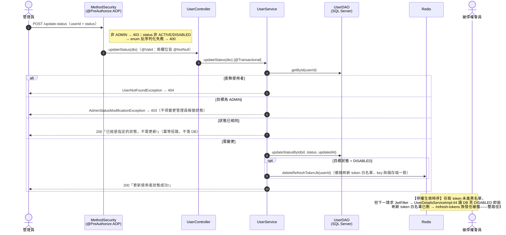
```mermaid
sequenceDiagram
    autonumber
    actor Admin as 管理員
    participant MS as MethodSecurity<br/>(@PreAuthorize AOP)
    participant Ctrl as UserController
    participant Svc as UserService
    participant DAO as UserDAO<br/>(SQL Server)
    participant Redis as Redis
    actor Target as 被停權會員

    Admin->>MS: POST /update-status（userId + status）
    Note right of MS: 非 ADMIN → 403；status 非 ACTIVE/DISABLED<br/>→ enum 反序列化失敗 → 400
    MS->>Ctrl: updateStatus(dto)（@Valid：兩欄位皆 @NotNull）
    Ctrl->>Svc: updateStatus(dto) [@Transactional]
    Svc->>DAO: getById(userId)
    alt 查無使用者
        Svc-->>Admin: UserNotFoundException → 404
    else 目標為 ADMIN
        Svc-->>Admin: AdminStatusModificationException → 403（不得變更管理員帳號狀態）
    else 狀態已相同
        Svc-->>Admin: 200「已經是指定的狀態，不需更新!」（冪等短路，不落 DB）
    else 需變更
        Svc->>DAO: updateStatusById(id, status, updatedAt)
        opt 目標狀態 = DISABLED
            Svc->>Redis: deleteRefreshTokenJti(userId)（撤銷刷新 token 白名單，key 與儲存端一致）
        end
        Svc-->>Admin: 200「更新使用者狀態成功!」
    end

    Note over Target, Redis: 【停權生效時序】存取 token 未進黑名單，<br/>但下一請求 JwtFilter → UserDetailsServiceImpl:44 讀 DB 見 DISABLED 即拋例外 → 401；<br/>刷新 token 白名單已刪 → /refresh-tokens 換發也被擋——雙路徑封死
```

## 3. 重點摘要（給技術主管）

### UC_A 修改個人資料

本功能透過獨立的個人資訊修改端點（名稱、生日、電話）提供一般會員變更個資的管道，並在後端實施水平越權防護與等級自動升級機制。

- **執行流程**：
  - 會員調用更新端點，在 Controller 入口由 Jakarta Validation 驗證輸入格式（如電話 regex、生日是否為未來日期，不符拋 400）。
  - `UserService` 在 `@Transactional` 交易中，呼叫 `getAuthenticatedEmail()` 從 `SecurityContextHolder` 取得當前使用者 Email，並至資料庫撈取使用者（防範傳入他人 userId 之越權行為，查無拋 404）。
  - 若為更新姓名或電話，呼叫 DAO 進行欄位更新並將修改時間設為 UTC 當前時間。
  - 若為更新生日，呼叫 DAO 更新出生日期的同時，在資料庫層執行 `updateMembershipTierByEmail` 嘗試將 Basic 等級升級至 Premium。
  - 升級 SQL 設定 `WHERE birth_date IS NOT NULL AND membership_tier_id != PREMIUM` 條件，於資料庫層原子化完成判定與升級以防重複升級。
  - 根據 SQL 影響列數判斷是否升級成功，返回對應之提示文案給前端。

### UC_B 變更密碼

本功能提供會員變更登入密碼的雙重校驗邏輯，並透過單向雜湊確保密碼落庫的安全性。

- **執行流程**：
  - 會員輸入舊密碼與新密碼，Controller 層校驗欄位非空且新密碼長度為 8-20 字元（不符拋 400）。
  - Service 層從 SecurityContext 取得 Email，自資料庫加載使用者 Entity，若無則拋 404。
  - 調用 `BCryptPasswordEncoder.matches` 比對輸入之舊密碼與資料庫密碼，若不相符則拋出 `InvalidCredentialsException` 返回 401。
  - 比對正確後，調用 `encode` 將新密碼進行單向雜湊，並呼叫 DAO 更新密碼至資料庫，回傳成功訊息。

### UC_C 查詢會員名單

本功能為後台管理端專用之會員資料分頁查詢功能，完全採用角色型方法授權把關。

- **執行流程**：
  - 管理員發送查詢參數（關鍵字、分頁頁碼與尺寸），由 AOP 切面攔截 `@PreAuthorize("hasRole('ADMIN')")`，非 ADMIN 角色直接返回 403。
  - 成功進入 Service 後，呼叫 `UserDAO.getAllPaginated`，在 SQL 內以 `username` 或 `email` 進行 LIKE 模糊比對。
  - 使用 SQL Server 專有的 `OFFSET/FETCH` 執行分頁查詢，排序依 `id` 遞增。
  - 呼叫 `countAll` 撈取符合條件之會員總數，該查詢與分頁列表共用同一組 Mybatis 動態 `<where>` 條件以防數據不一致。
  - 將 Entity 轉化為 `UserVO`（隱蔽密碼欄位、時間補上 UTC 時區），最終封裝為 `PaginatedVO` 返回 200 OK。

### UC_D 啟用停用會員帳號

本功能允許管理員變更會員的啟用狀態（ACTIVE/DISABLED），並在後端執行狀態變更後的即時階段性撤銷。

- **執行流程**：
  - 管理員傳入 `userId` 與目標 `status`，經過 Controller 欄位非空校驗（若目標狀態值非法則在反序列化時即拋 400 攔截）。
  - AOP 攔截角色為 `ADMIN` 後放行至 Service，Service 於 `@Transactional` 交易中調用 `getById` 撈取目標用戶（查無拋 404）。
  - 檢查目標用戶是否為管理員，若目標為管理員則拋出 `AdminStatusModificationException` 返回 403，防範管理員互相停權。
  - 檢查目標狀態與目前狀態是否相同，若一致則觸發冪等短路直接返回成功，不落資料庫寫入。
  - 呼叫 DAO 更新狀態為 `DISABLED`。
  - 若更新狀態為停權，同步呼叫 Redis 刪除該使用者的 `refreshTokenJti`（key 與儲存端統一採用 `userId` 格式）。
  - 後續受停權之會員若發起請求，`JwtFilter` 於 `UserDetailsServiceImpl` 從資料庫加載該帳號時，因讀取到 `DISABLED` 直接拋出例外，使存取與刷新雙路徑立即封死。

# 4. 車站書籤

> 對應用例：**收藏車站書籤**、**查詢車站書籤**（單筆／列表）、**移除車站書籤**、**匯出書籤 Excel**（皆為一般會員可操作）。
> 檔案：`StationBookmarkController.java`、`StationBookmarkService.java`、`StationBookmarkDAO.java`、`mappers/StationBookmarkMapper.xml`

## 1. 時序釐清與盲點審查

### 1.1 動態執行順序與依賴關係

- **共同前置——登入即可**：四個端點全屬會員層（`anyRequest().authenticated()`），本模組沒有任何 `@PreAuthorize`——先前兩端點（查全部、匯出）Swagger 誤標 403 的問題，是以「修正文件」而非「加 ADMIN 限制」收場，等於確認開放給一般會員是刻意決策。
- **收藏 → 其他三者——資料前置**：查詢、移除、匯出都以「已存在書籤」為前提，移除所需的 `bookmarkId` 實務上來自查詢列表的回傳。這是操作上的前置條件而非行為相依，同樣不畫 include/extend。
- **收藏內部——四步 fail-fast 檢查鏈，順序固定**：當前使用者存在（404）→ 車站存在（404，跨模組問 `MetroService`）→ 未重複收藏（400，只看有效書籤）→ 未達會員等級上限（400，上限 JOIN `membership_tiers` 查表、非硬編碼，與旅程規劃同一套款式）。全部通過才 insert，再以自增 id 回查 JOIN 後的顯示資料組回應。
- **移除 ↔ 收藏——合法循環**：軟刪除只更新 `deleted_at`，所有查詢與匯出立即看不到；重複檢查只認有效書籤，因此「刪除 → 對同站再收藏」是合法路徑，舊列軟刪除、新列另起。
- **匯出——當下快照**：範圍固定為全部有效書籤，不受列表分頁與關鍵字影響；本模組資料無生命週期排程（對比聊天室每日清空），匯出與其他用例無時序耦合。

### 1.3 Coding style 一致性判定

**遵守的部分**：建構子注入、SLF4J、DTO 進／VO 出、`@Valid` 驗證、Swagger 標註完整、例外分流（404／400 各有專屬例外）、時間一律 UTC；Mapper 的 `<sql id="bookmarkVOSelectAndJoins">` 共用片段是全案 Mapper 少見的重用款式，且所有查詢 SQL 皆帶 `deleted_at IS NULL` 過濾（Mapper XML 必查點通過；唯一例外 `getById` 是刻意回原始資料、由 Service 層 filter 判斷已刪）。

**待修改處**，按重要性排序：

| #   | 位置                                         | 問題                                                                                                            | 修改建議                                                                                                                                                                          |
| --- | -------------------------------------------- | --------------------------------------------------------------------------------------------------------------- | --------------------------------------------------------------------------------------------------------------------------------------------------------------------------------- |
| 1   | `StationBookmarkService:156-166`             | **【安全漏洞・水平越權】**`deleteBookmark` 未驗證擁有權，任何會員可軟刪除他人書籤（詳見 1.2 #1）                | 刪除前比對 `bookmark.getUserId()` 與當前使用者 id，不符丟 403 專屬例外（參考旅程規劃的 `getCurrentUserIdAndCheckOwnership()` 收斂款式），並補 `GlobalExceptionHandler` 對應       |
| 2   | `StationBookmarkController:114-124、158-171` | **【個資外洩疑慮】**列表與匯出回傳全站會員 username／email，端點僅需登入（詳見 1.2 #2）                         | 二擇一：加 `@PreAuthorize("hasRole('ADMIN')")` 限管理員，或改為僅回傳當前使用者自己的書籤                                                                                         |
| 3   | `StationBookmarkService` 全類                | 無任何 `@Transactional`，寫入款式與 user／tripPlan 模組不一致；`createBookmark` 檢查與寫入間有 TOCTOU 競態      | 寫入方法補 `@Transactional`；重複防線下沉 DB——SQL Server filtered unique index：`CREATE UNIQUE INDEX ... ON user_station_bookmarks(user_id, station_id) WHERE deleted_at IS NULL` |
| 4   | `StationBookmarkController:117-118`          | `page`／`size` 未驗證，`size=0` → 除零＋`FETCH NEXT 0 ROWS` SQL 語法錯誤 → 500（與 user 模組同病）              | `@Min(0)`（page）、`@Min(1)`（size），走 400 分流                                                                                                                                 |
| 5   | `StationBookmarkController` 全檔             | 8 格縮排，但同模組的 Service／DAO 是 4 格——同一模組內部縮排都不一致                                             | 統一 4 格，以 formatter 固定                                                                                                                                                      |
| 6   | `StationBookmarkService:229-231`             | 匯出失敗把 `IOException` 換成自訂例外時未帶 cause，遺失根因（同 `RailClientConfig` 列過的問題款式）             | 自訂例外補 `(String, Throwable)` 建構子並傳入 `error`                                                                                                                             |
| 7   | `StationBookmarkService:50-51、81、86`       | 跨模組依賴款式不一：對 metro 走 Service（`existsStationById`）、對 user 卻直接注入**他模組的 DAO**（`UserDAO`） | 統一走對方模組的 Service 介面，DAO 保留為模組內部實作細節                                                                                                                         |
| 8   | `StationBookmarkMapper.xml:28-30、46-48、80` | LIKE 關鍵字未跳脫 `%`／`_` 萬用字元（與 user 模組同病，`#{}` 已參數化、無注入風險）                             | `ESCAPE` 處理或文件註明                                                                                                                                                           |

## 2. 各 Use Case 時序圖

### 收藏車站書籤（create-bookmark）

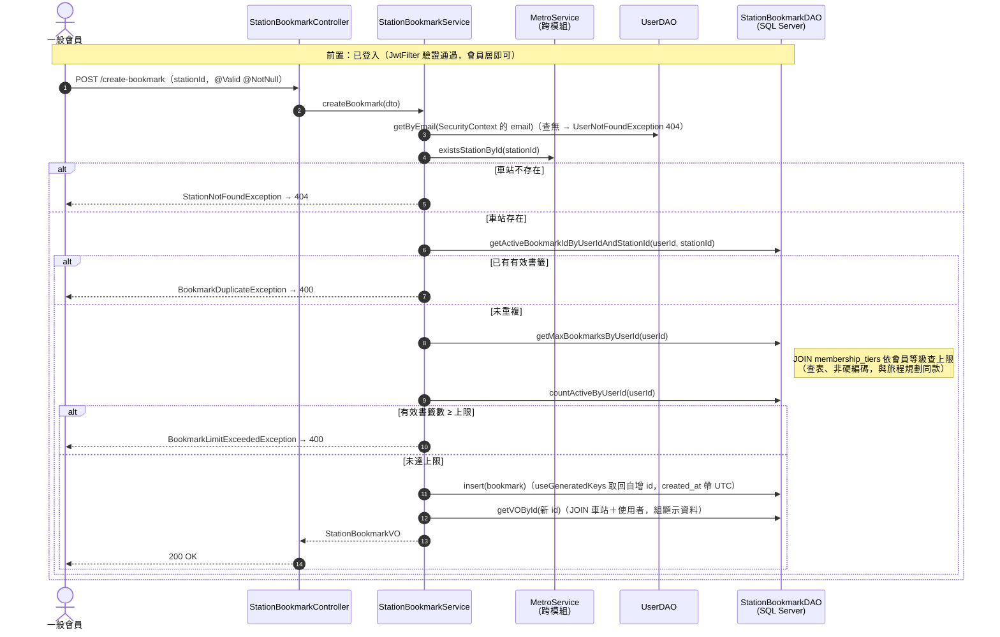
```mermaid
sequenceDiagram
    autonumber
    actor Member as 一般會員
    participant Ctrl as StationBookmarkController
    participant Svc as StationBookmarkService
    participant Metro as MetroService<br/>(跨模組)
    participant UDAO as UserDAO
    participant BDAO as StationBookmarkDAO<br/>(SQL Server)

    Note over Member, BDAO: 前置：已登入（JwtFilter 驗證通過，會員層即可）
    Member->>Ctrl: POST /create-bookmark（stationId，@Valid @NotNull）
    Ctrl->>Svc: createBookmark(dto)
    Svc->>UDAO: getByEmail(SecurityContext 的 email)（查無 → UserNotFoundException 404）
    Svc->>Metro: existsStationById(stationId)
    alt 車站不存在
        Svc-->>Member: StationNotFoundException → 404
    else 車站存在
        Svc->>BDAO: getActiveBookmarkIdByUserIdAndStationId(userId, stationId)
        alt 已有有效書籤
            Svc-->>Member: BookmarkDuplicateException → 400
        else 未重複
            Svc->>BDAO: getMaxBookmarksByUserId(userId)
            Note right of BDAO: JOIN membership_tiers 依會員等級查上限<br/>（查表、非硬編碼，與旅程規劃同款）
            Svc->>BDAO: countActiveByUserId(userId)
            alt 有效書籤數 ≥ 上限
                Svc-->>Member: BookmarkLimitExceededException → 400
            else 未達上限
                Svc->>BDAO: insert(bookmark)（useGeneratedKeys 取回自增 id，created_at 帶 UTC）
                Svc->>BDAO: getVOById(新 id)（JOIN 車站＋使用者，組顯示資料）
                Svc-->>Ctrl: StationBookmarkVO
                Ctrl-->>Member: 200 OK
            end
        end
    end
```

### 查詢車站書籤（get-bookmark-by-station-name／get-all-bookmark-paginated）

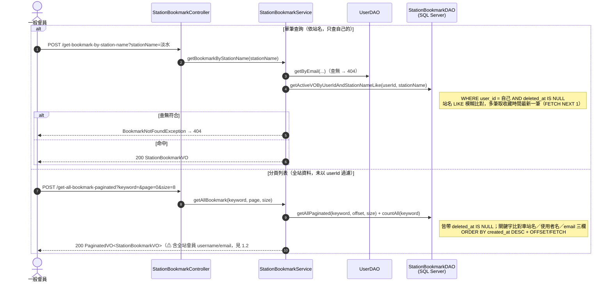
```mermaid
sequenceDiagram
    autonumber
    actor Member as 一般會員
    participant Ctrl as StationBookmarkController
    participant Svc as StationBookmarkService
    participant UDAO as UserDAO
    participant BDAO as StationBookmarkDAO<br/>(SQL Server)

    alt 單筆查詢（依站名，只查自己的）
        Member->>Ctrl: POST /get-bookmark-by-station-name?stationName=淡水
        Ctrl->>Svc: getBookmarkByStationName(stationName)
        Svc->>UDAO: getByEmail(...)（查無 → 404）
        Svc->>BDAO: getActiveVOByUserIdAndStationNameLike(userId, stationName)
        Note right of BDAO: WHERE user_id = 自己 AND deleted_at IS NULL<br/>站名 LIKE 模糊比對，多筆取收藏時間最新一筆（FETCH NEXT 1）
        alt 查無符合
            Svc-->>Member: BookmarkNotFoundException → 404
        else 命中
            Svc-->>Member: 200 StationBookmarkVO
        end
    else 分頁列表（全站資料，未以 userId 過濾）
        Member->>Ctrl: POST /get-all-bookmark-paginated?keyword=&page=0&size=8
        Ctrl->>Svc: getAllBookmark(keyword, page, size)
        Svc->>BDAO: getAllPaginated(keyword, offset, size) + countAll(keyword)
        Note right of BDAO: 皆帶 deleted_at IS NULL；關鍵字比對車站名／使用者名／email 三欄<br/>ORDER BY created_at DESC + OFFSET/FETCH
        Svc-->>Member: 200 PaginatedVO<StationBookmarkVO>（⚠ 含全站會員 username/email，見 1.2 #2）
    end
```

### 移除車站書籤（delete-bookmark）

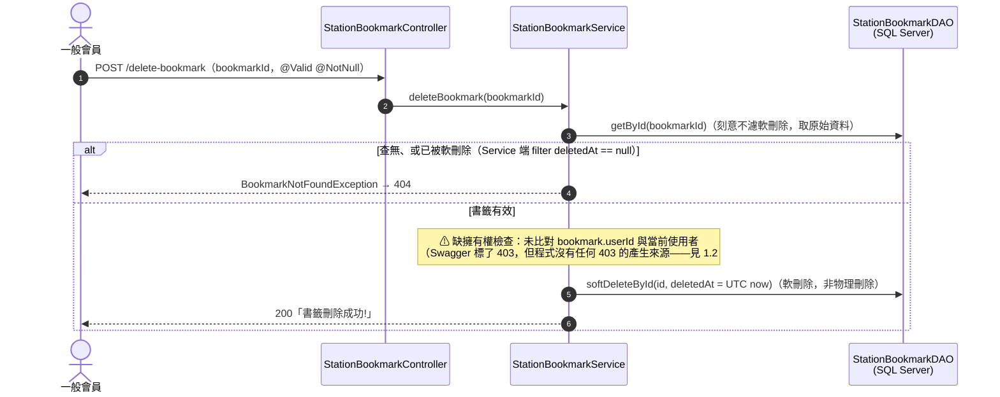
```mermaid
sequenceDiagram
    autonumber
    actor Member as 一般會員
    participant Ctrl as StationBookmarkController
    participant Svc as StationBookmarkService
    participant BDAO as StationBookmarkDAO<br/>(SQL Server)

    Member->>Ctrl: POST /delete-bookmark（bookmarkId，@Valid @NotNull）
    Ctrl->>Svc: deleteBookmark(bookmarkId)
    Svc->>BDAO: getById(bookmarkId)（刻意不濾軟刪除，取原始資料）
    alt 查無、或已被軟刪除（Service 端 filter deletedAt == null）
        Svc-->>Member: BookmarkNotFoundException → 404
    else 書籤有效
        Note over Svc: ⚠ 缺擁有權檢查：未比對 bookmark.userId 與當前使用者<br/>（Swagger 標了 403，但程式沒有任何 403 的產生來源——見 1.2 #1）
        Svc->>BDAO: softDeleteById(id, deletedAt = UTC now)（軟刪除，非物理刪除）
        Svc-->>Member: 200「書籤刪除成功!」
    end
```

### 匯出書籤 Excel（get-excel）

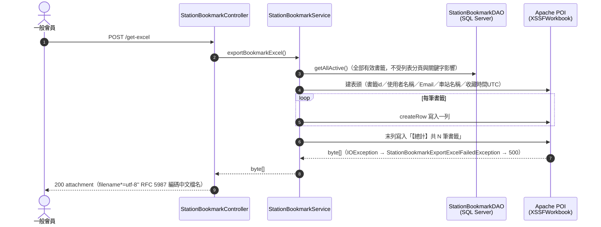
```mermaid
sequenceDiagram
    autonumber
    actor Member as 一般會員
    participant Ctrl as StationBookmarkController
    participant Svc as StationBookmarkService
    participant BDAO as StationBookmarkDAO<br/>(SQL Server)
    participant POI as Apache POI<br/>(XSSFWorkbook)

    Member->>Ctrl: POST /get-excel
    Ctrl->>Svc: exportBookmarkExcel()
    Svc->>BDAO: getAllActive()（全部有效書籤，不受列表分頁與關鍵字影響）
    Svc->>POI: 建表頭（書籤id／使用者名稱／Email／車站名稱／收藏時間UTC）
    loop 每筆書籤
        Svc->>POI: createRow 寫入一列
    end
    Svc->>POI: 末列寫入「【總計】共 N 筆書籤」
    POI-->>Svc: byte[]（IOException → StationBookmarkExportExcelFailedException → 500）
    Svc-->>Ctrl: byte[]
    Ctrl-->>Member: 200 attachment（filename*=utf-8'' RFC 5987 編碼中文檔名）
```

## 3. 重點摘要（給技術主管）

### 收藏車站書籤

本功能提供一般會員收藏捷運車站的服務，並依會員等級限制收藏總上限。

- **執行流程**：
  - 會員提交 `stationId`，Controller 進行基本非空驗證後調用 `createBookmark`。
  - Service 藉由 Email 向 `UserDAO` 獲取當前 `userId`，若用戶不存在拋 404。
  - 跨模組調用 `MetroService.existsStationById(stationId)`，若車站不存在則拋 404 攔截。
  - 調用 `StationBookmarkDAO` 檢查該用戶是否已收藏該站（即取得有效之書籤 id），若已收藏則拋出重複異常 (400)。
  - 呼叫 DAO 撈取對應等級上限（JOIN `membership_tiers` 查表），並查詢該用戶當前已有效收藏數，若超過上限則拋出超限異常 (400)。
  - 全部檢查通過後，呼叫 DAO 執行 insert，並利用 `useGeneratedKeys` 獲取自增 id。
  - 依自增 id 再次呼叫 `getVOById` 執行 JOIN 查詢，組裝完整的 `StationBookmarkVO` 返回客戶端。

### 查詢車站書籤

本功能包含會員對個人特定書籤的單筆模糊查詢，以及全站書籤的分頁列表查詢。

- **執行流程**：
  - **單筆模糊查詢**：傳入站名，Service 驗證用戶身分後，調用 DAO 限制 `user_id = 當前用戶` 與 `deleted_at IS NULL`，執行站名 LIKE 模糊比對。當有多筆符合時按收藏時間倒序取第一筆，查無則拋 404。
  - **分頁列表查詢**：管理端或前台發送關鍵字、分頁參數，DAO 在 SQL 中對車站名、使用者名與 email 進行模糊比對，並限制 `deleted_at IS NULL`。
  - 利用 `OFFSET/FETCH` 依建立時間倒序回傳列表，並同步呼叫 `countAll` 取得總數，組裝為 `PaginatedVO` 返回。

### 移除車站書籤

本功能藉由軟刪除機制提供會員取消收藏特定車站書籤的管道。

- **執行流程**：
  - 會員傳入 `bookmarkId`，Controller 校驗後發起刪除。
  - Service 層調用 `getById` 撈取原始書籤資料（該查詢刻意不排除軟刪除資料）。
  - 在 Service 層過濾已刪除資料（確認 `deletedAt` 為空），若不存在或已刪除則統一拋 404 以防隱私洩漏。
  - 通過有效性判斷後，調用 DAO 更新 `deleted_at` 欄位為當前 UTC 時間以執行軟刪除，並釋放該收藏配額。

### 匯出書籤 Excel

本功能支援將全站所有有效書籤匯出為 Excel 工作表，以提供資料快照備份。

- **執行流程**：
  - 會員提交匯出請求，Service 呼叫 DAO 取得當前資料庫中所有有效書籤列表（排除軟刪除，不受分頁限制）。
  - 利用 Apache POI 建立 `XSSFWorkbook`，寫入欄位表頭（書籤 ID、用戶名稱、Email、車站名稱、收藏時間 UTC）。
  - 遍歷書籤列表寫入對應資料列，並於最後一列寫入總計筆數。
  - 將 Workbook 寫入位元組流，以 RFC 5987 規範編碼中文檔名並放入 Attachment 回應，若發生 `IOException` 則拋出自定義異常以 500 處理。

# 5. ✨ 車站聊天室

> 對應檔案：`WebSocketConfig.java`、`StompAuthChannelInterceptor.java`、`StationChatController.java`、`StationChatStompController.java`、`StationChatService.java`、`StationChatDAO.java`、`StationChatMapper.xml`、`StationChatMessageCleanupScheduler.java`

## 1. 時序釐清與盲點審查

### 1.1 動態執行順序與依賴關係

**雙協定、雙驗證路徑**。本模組是全系統唯一同時走 HTTP 與 STOMP（WebSocket）兩種協定的模組，兩條路徑的驗證時機完全不同：

- **HTTP 路徑**（查詢留言／公告、公告管理、匯出 Excel）：照常走 `JwtFilter` 每請求驗證，管理端點再疊 `@PreAuthorize("hasRole('ADMIN')")`（`StationChatController:124、152、174、196`，即全域機制講的「聊天室管理 4」）。
- **STOMP 路徑**（發言、刪言）：HTTP 的 `JwtFilter` 攔不到 WebSocket frame，因此 handshake 端點 `/ws/**` 直接列入 `SecurityConstants.API_PUBLIC_ALL`（`SecurityConstants:30`）放行，驗證延後到 STOMP **CONNECT 這一個指令**由 `StompAuthChannelInterceptor` 執行（`StompAuthChannelInterceptor:66-109`）——缺 token、簽章無效、jti 在 Redis 黑名單三種情況都丟 `StompAuthException` 拒絕連線，通過後把 Principal 綁進整條 STOMP session，**後續 SEND／SUBSCRIBE 一律放行不重驗**。

**WS 生命週期的固定順序**：CONNECT（驗證一次）→ SUBSCRIBE `/topic/station-chat/{stationId}` → SEND 發言或刪言 → Service 寫 DB 成功後由 `SimpMessagingTemplate` 廣播 `StationChatEventVO`（NEW 帶完整留言、DELETE 只帶 id）給訂閱該站的所有人。廣播一律在 DB 寫入成功之後，順序正確——失敗的操作不會產生幽靈事件。

**發言的檢查鏈**（`StationChatService:228-288`）：使用者存在（404）→ 車站存在（跨模組委派 `MetroService`，404）→ chatType 互斥驗證（TEXT 必有 content 不可帶 tripPlanId；TRIP_PLAN 相反，400）→ 旅程分享再驗「旅程存在且未軟刪」與「擁有者是本人」（`:256-262`，404／403，防止分享他人旅程）→ 每日則數配額（JOIN `membership_tiers` 查表、非硬編碼，超限 400）→ insert 後以自增 id 回查 JOIN 好的 VO 供廣播。

**刪言的雙軌授權**（`StationChatService:300-319`）：取原始留言 → 過濾已軟刪 → **驗證留言歸屬於 URL 上的車站**（`:308`，防止跨站亂刪與錯誤廣播）→ `isOwner || isAdmin` 雙軌判定（`:311-315`）。這是與車站書籤 `deleteBookmark` 最鮮明的對比——同樣是刪除資源，聊天室做對了擁有權檢查，書籤漏了。

**資料生命週期的時序耦合**：留言只活一天——`StationChatMessageCleanupScheduler` 每日 03:00 **物理清空**全站留言（cron `0 0 3 * * *`，整段 try-catch 記 log，單次失敗不擋下次）；管理員匯出 Excel 是「指定車站、不分頁的完整紀錄」，實質是資料歸檔的最後機會，兩功能存在硬性的先後依賴：**匯出必須發生在下一次 03:00 之前，否則資料永久消失**。公告則走軟刪除、長期存活，與留言的生命週期完全不同。

### 1.3 Coding style 一致性判定

**亮點**：`StompAuthChannelInterceptor` 的驗證步驟嚴格比照 `JwtFilter`（含 Redis 黑名單檢查），並附上「必須用 `getAccessor` 取原始 accessor、`wrap` 會遺失 `setUser`」的精準技術註解；`WebSocketConfig:87-99` 讓 STOMP 共用 Spring 管理的 ObjectMapper，避免 HTTP 與 STOMP 的 JSON 行為分裂；Mapper 以 `CASE WHEN` 對已刪旅程分享優雅降級為「該旅程分享已被移除」（`StationChatMapper.xml:17-20`）；`enrichTravelTime` 計算失敗只記警告、不拖垮留言回傳。

待修項目：

| #   | 位置                                                                  | 問題                                                                                                                           | 修改建議                                                      |
| --- | --------------------------------------------------------------------- | ------------------------------------------------------------------------------------------------------------------------------ | ------------------------------------------------------------- |
| 1   | 兩個 Controller、DAO（8 格）vs Service（4 格）                        | 同模組縮排不一致，與書籤模組同病                                                                                               | 統一 4 格並以 formatter 收斂                                  |
| 2   | `StationChatService` 全類                                             | 無任何 `@Transactional`；`sendMessage` 是「查配額→insert→回查」複合操作                                                        | 寫入方法補 `@Transactional`，與 user／tripPlan 模組對齊       |
| 3   | `StationChatStompController:135-141`                                  | 通用例外處理直接回 `exception.getMessage()`，洩漏內部訊息                                                                      | 非預期例外回統一繁中訊息，細節只進 log                        |
| 4   | `StationChatController:78-79、103-104`                                | `page`／`size` 未驗證，`size=0` → 除以零＋SQL Server `FETCH NEXT 0` 語法錯誤 → 500                                             | 加 `@Min(0)`／`@Min(1)`，三個模組一併修                       |
| 5   | `ChatDailyLimitExceededException`、`ChatMessageAccessDeniedException` | 未註冊 `GlobalExceptionHandler`（現只走 STOMP 路徑無妨，但 Service 若被 HTTP 重用即變 500）                                    | 預先補上 429／403 的 handler                                  |
| 6   | `StationChatService:322`、`StationChatDAO:168` Javadoc                | 「磬刪」為錯字                                                                                                                 | 改為「清刪（物理刪除）」                                      |
| 7   | `StationChatService:82` Javadoc                                       | `getMessages` 缺 `@throws StationNotFoundException`（`getAnnouncements` 有）                                                   | 補齊，公開方法 Javadoc 規範一致                               |
| 8   | `StationChatController:118-120`                                       | 匯出 200 的 content 標成 `application/json` String，實為二進位 xlsx；summary 寫「完整聊天紀錄」、response 寫「當日」，語意混用 | mediaType 改 octet-stream，統一「當日」用語並註明依賴清理排程 |
| 9   | `StationChatService:391-425`                                          | 匯出 catch `IOException` 未帶 cause（與書籤同病）                                                                              | 例外建構子傳入原始 error                                      |

## 2. 各 Use Case 時序圖

### 查詢車站訊息與公告（HTTP）

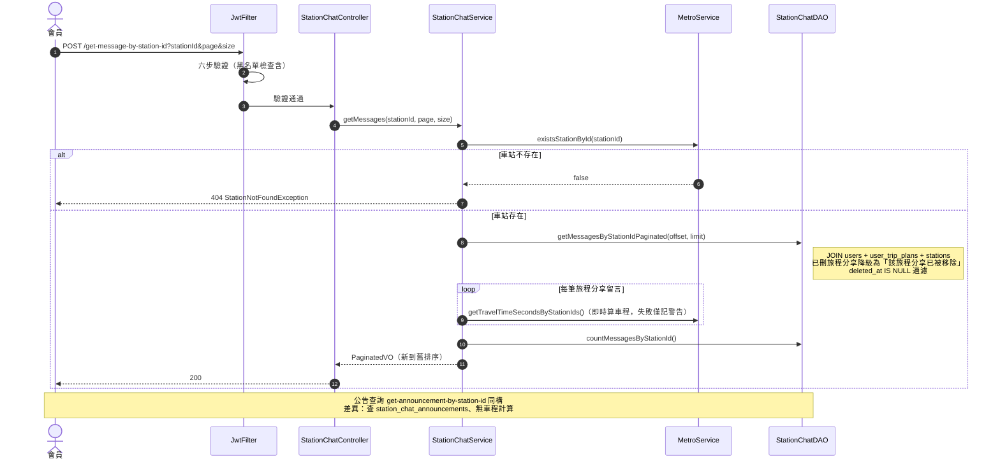
```mermaid
sequenceDiagram
    autonumber
    actor Member as 會員
    participant JF as JwtFilter
    participant Ctrl as StationChatController
    participant Svc as StationChatService
    participant Metro as MetroService
    participant CDAO as StationChatDAO

    Member->>JF: POST /get-message-by-station-id?stationId&page&size
    JF->>JF: 六步驗證（黑名單檢查含）
    JF->>Ctrl: 驗證通過
    Ctrl->>Svc: getMessages(stationId, page, size)
    Svc->>Metro: existsStationById(stationId)
    alt 車站不存在
        Metro-->>Svc: false
        Svc-->>Member: 404 StationNotFoundException
    else 車站存在
        Svc->>CDAO: getMessagesByStationIdPaginated(offset, limit)
        Note right of CDAO: JOIN users + user_trip_plans + stations<br/>已刪旅程分享降級為「該旅程分享已被移除」<br/>deleted_at IS NULL 過濾
        loop 每筆旅程分享留言
            Svc->>Metro: getTravelTimeSecondsByStationIds()（即時算車程，失敗僅記警告）
        end
        Svc->>CDAO: countMessagesByStationId()
        Svc-->>Ctrl: PaginatedVO（新到舊排序）
        Ctrl-->>Member: 200
    end
    Note over Member,CDAO: 公告查詢 get-announcement-by-station-id 同構<br/>差異：查 station_chat_announcements、無車程計算
```

### 即時聊天：連線、發言與刪言（STOMP）

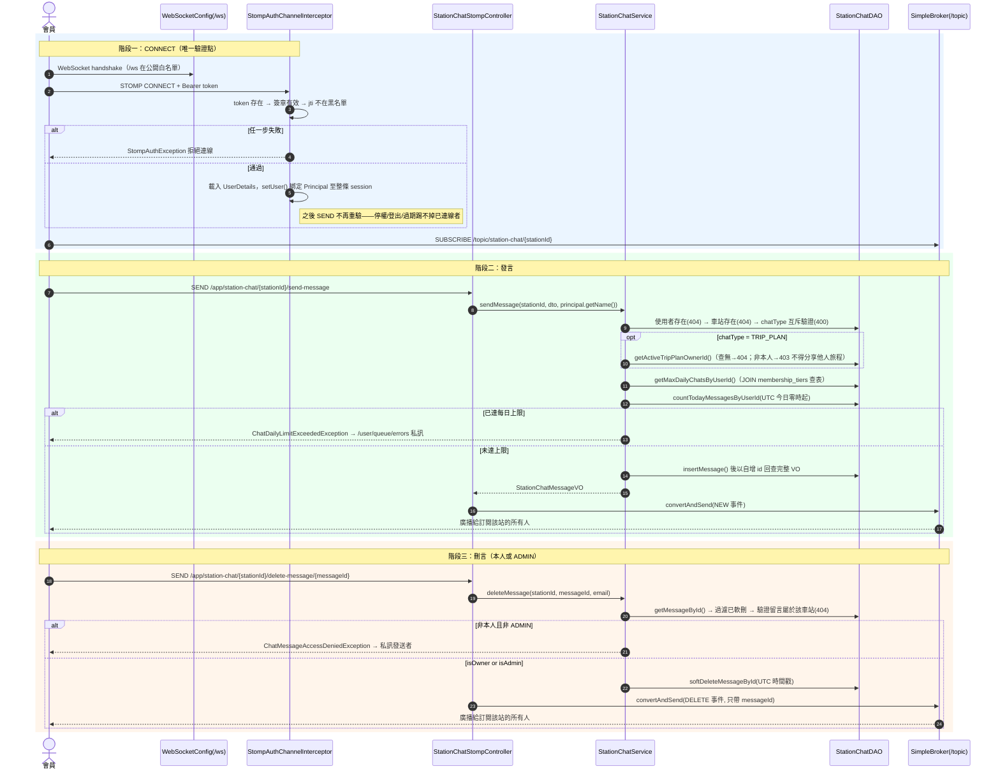
```mermaid
sequenceDiagram
    autonumber
    actor Member as 會員
    participant WS as WebSocketConfig(/ws)
    participant Auth as StompAuthChannelInterceptor
    participant Stomp as StationChatStompController
    participant Svc as StationChatService
    participant CDAO as StationChatDAO
    participant Broker as SimpleBroker(/topic)

    rect rgb(235, 245, 255)
        Note over Member,Auth: 階段一：CONNECT（唯一驗證點）
        Member->>WS: WebSocket handshake（/ws 在公開白名單）
        Member->>Auth: STOMP CONNECT + Bearer token
        Auth->>Auth: token 存在 → 簽章有效 → jti 不在黑名單
        alt 任一步失敗
            Auth-->>Member: StompAuthException 拒絕連線
        else 通過
            Auth->>Auth: 載入 UserDetails，setUser() 綁定 Principal 至整條 session
            Note right of Auth: 之後 SEND 不再重驗——停權/登出/過期踢不掉已連線者
        end
        Member->>Broker: SUBSCRIBE /topic/station-chat/{stationId}
    end

    rect rgb(235, 255, 240)
        Note over Member,Broker: 階段二：發言
        Member->>Stomp: SEND /app/station-chat/{stationId}/send-message
        Stomp->>Svc: sendMessage(stationId, dto, principal.getName())
        Svc->>CDAO: 使用者存在(404) → 車站存在(404) → chatType 互斥驗證(400)
        opt chatType = TRIP_PLAN
            Svc->>CDAO: getActiveTripPlanOwnerId()（查無→404；非本人→403 不得分享他人旅程）
        end
        Svc->>CDAO: getMaxDailyChatsByUserId()（JOIN membership_tiers 查表）
        Svc->>CDAO: countTodayMessagesByUserId(UTC 今日零時起)
        alt 已達每日上限
            Svc-->>Member: ChatDailyLimitExceededException → /user/queue/errors 私訊
        else 未達上限
            Svc->>CDAO: insertMessage() 後以自增 id 回查完整 VO
            Svc-->>Stomp: StationChatMessageVO
            Stomp->>Broker: convertAndSend(NEW 事件)
            Broker-->>Member: 廣播給訂閱該站的所有人
        end
    end

    rect rgb(255, 245, 235)
        Note over Member,Broker: 階段三：刪言（本人或 ADMIN）
        Member->>Stomp: SEND /app/station-chat/{stationId}/delete-message/{messageId}
        Stomp->>Svc: deleteMessage(stationId, messageId, email)
        Svc->>CDAO: getMessageById() → 過濾已軟刪 → 驗證留言屬於該車站(404)
        alt 非本人且非 ADMIN
            Svc-->>Member: ChatMessageAccessDeniedException → 私訊發送者
        else isOwner or isAdmin
            Svc->>CDAO: softDeleteMessageById(UTC 時間戳)
            Stomp->>Broker: convertAndSend(DELETE 事件, 只帶 messageId)
            Broker-->>Member: 廣播給訂閱該站的所有人
        end
    end
```

### 管理公告（ADMIN）

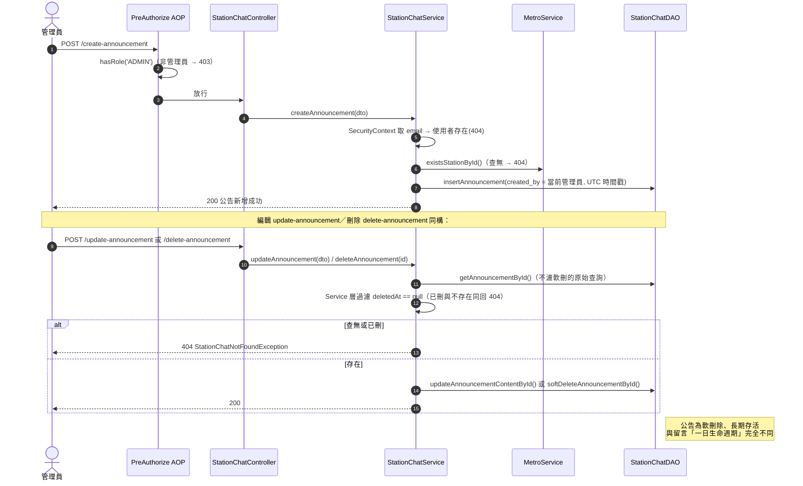
```mermaid
sequenceDiagram
    autonumber
    actor Admin as 管理員
    participant AOP as PreAuthorize AOP
    participant Ctrl as StationChatController
    participant Svc as StationChatService
    participant Metro as MetroService
    participant CDAO as StationChatDAO

    Admin->>AOP: POST /create-announcement
    AOP->>AOP: hasRole('ADMIN')（非管理員 → 403）
    AOP->>Ctrl: 放行
    Ctrl->>Svc: createAnnouncement(dto)
    Svc->>Svc: SecurityContext 取 email → 使用者存在(404)
    Svc->>Metro: existsStationById()（查無 → 404）
    Svc->>CDAO: insertAnnouncement(created_by = 當前管理員, UTC 時間戳)
    Svc-->>Admin: 200 公告新增成功

    Note over Admin,CDAO: 編輯 update-announcement／刪除 delete-announcement 同構：
    Admin->>Ctrl: POST /update-announcement 或 /delete-announcement
    Ctrl->>Svc: updateAnnouncement(dto) / deleteAnnouncement(id)
    Svc->>CDAO: getAnnouncementById()（不濾軟刪的原始查詢）
    Svc->>Svc: Service 層過濾 deletedAt == null（已刪與不存在同回 404）
    alt 查無或已刪
        Svc-->>Admin: 404 StationChatNotFoundException
    else 存在
        Svc->>CDAO: updateAnnouncementContentById() 或 softDeleteAnnouncementById()
        Svc-->>Admin: 200
    end
    Note right of CDAO: 公告為軟刪除、長期存活<br/>與留言「一日生命週期」完全不同
```

### 匯出當日聊天紀錄 Excel（ADMIN，含清理排程的時序耦合）

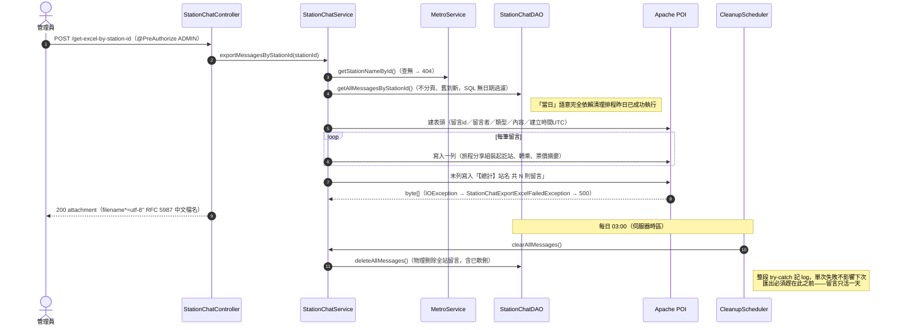
```mermaid
sequenceDiagram
    autonumber
    actor Admin as 管理員
    participant Ctrl as StationChatController
    participant Svc as StationChatService
    participant Metro as MetroService
    participant CDAO as StationChatDAO
    participant POI as Apache POI
    participant Sched as CleanupScheduler

    Admin->>Ctrl: POST /get-excel-by-station-id（@PreAuthorize ADMIN）
    Ctrl->>Svc: exportMessagesByStationId(stationId)
    Svc->>Metro: getStationNameById()（查無 → 404）
    Svc->>CDAO: getAllMessagesByStationId()（不分頁、舊到新，SQL 無日期過濾）
    Note right of CDAO: 「當日」語意完全依賴清理排程昨日已成功執行
    Svc->>POI: 建表頭（留言id／留言者／類型／內容／建立時間UTC）
    loop 每筆留言
        Svc->>POI: 寫入一列（旅程分享組裝起訖站、轉乘、票價摘要）
    end
    Svc->>POI: 末列寫入「【總計】站名 共 N 則留言」
    POI-->>Svc: byte[]（IOException → StationChatExportExcelFailedException → 500）
    Ctrl-->>Admin: 200 attachment（filename*=utf-8'' RFC 5987 中文檔名）

    Note over Sched,CDAO: 每日 03:00（伺服器時區）
    Sched->>Svc: clearAllMessages()
    Svc->>CDAO: deleteAllMessages()（物理刪除全站留言，含已軟刪）
    Note right of Sched: 整段 try-catch 記 log，單次失敗不影響下次<br/>匯出必須趕在此之前——留言只活一天
```

## 3. 重點摘要（給技術主管）

### 查詢車站訊息與公告

- **執行流程**：
  - 客戶端發送查詢請求，經 `JwtFilter` 完成權杖識別後進入 Controller。
  - Service 呼叫 DAO 執行撈取，留言查詢在 XML 內使用共用 `<sql>` 片段，一次性 JOIN 使用者、旅程規劃與起訖車站資料。
  - 於 SQL 內利用 `CASE WHEN` 進行防禦，當分享之旅程已被軟刪除時將名稱優雅降級為「該旅程分享已被移除」而非破圖；
  - 讀取列表時，對含有旅程分享的留言，Service 即時調用 `MetroService.getTravelTimeSecondsByStationIds` 進行圖演算法車程計算。
  - 計算外包於 try-catch 中，若計算失敗僅記 warn log，確保單筆計算出錯不拖垮整頁歷史留言的返回。

### 即時聊天（發言與刪言）

本功能採用 **STOMP 協定**，提供前台用戶在指定車站聊天室內進行發送與刪除留言的雙向即時通訊。

- **執行流程**：
  - 客戶端與後台 `/ws` 端點完成 handshake，該握手列於公開白名單不進行 Filter 攔截。
  - 身分驗證
    - 用戶發送 `CONNECT` 訊號，由 `StompAuthChannelInterceptor` 攔截進行簽章、過期與 Redis 黑名單校驗。通過後將 Principal 身分綁入該 WebSocket 會話，後續 `SEND/SUBSCRIBE` 不再重驗。
  - **發送留言**
    - 調用 `sendMessage`，Service 校驗用戶與車站存在性。
    - 比對 `chatType`（若為 `TEXT` 則不能傳入 `tripPlanId`；`TRIP_PLAN` 則必須傳入且該旅程必須存在、未刪、且屬於本人，否則拋 403/404）。
    - 依會員等級查表獲取每日配額，確認未超限後寫入資料庫，並調用 `SimpMessagingTemplate` 向該訂閱通道廣播新留言事件。
  - **刪除留言**：
    - 調用 `deleteMessage`，校驗留言有效性及所屬車站相符性。
    - 比對留言擁有者與當前登入者身分是否一致，或當前登入者是否具備 `ADMIN` 角色（雙軌授權）。
    - 通過後執行軟刪除，並廣播刪除事件以通知所有連線用戶即時移除該訊息。

### 管理公告

本功能供管理員針對車站公告進行新增、修改與軟刪除的生命週期控制。

- **執行流程**：
  - 管理員提交變更請求，經方法層 `@PreAuthorize("hasRole('ADMIN')")` 進行身分覆驗。
  - **新增公告**：後端自 SecurityContext 獲取當前管理員 Email 並解析出 `userId` 作為 `created_by` 寫入欄位，不信任前端傳入值。
  - **修改與刪除公告**：調用 DAO 撈取公告（包含已軟刪），於 Service 判斷是否已被刪除，查無或已刪均拋出 404 以防資訊探測。
  - 通過後呼叫 DAO 更新公告內容，或更新 `deleted_at` 欄位為 UTC 時間戳（軟刪除），使其在公開查詢中隱蔽。

### 匯出當日聊天紀錄 Excel

本功能支援管理員將指定車站的當日即時聊天留言物理歸檔並導出為 Excel。

- **執行流程**：
  - 管理員調用匯出端點，經權限校驗後進入 `StationChatService`。
  - 呼叫 DAO 撈取指定車站之全部留言（實務上因每日 03:00 會由 `StationChatMessageCleanupScheduler` 物理清空昨日前留言，故撈出為當日快照）。
  - 調用 Apache POI 建立工作表，遍歷寫入資料，以 RFC 5987 規範對檔名進行 UTF-8 編碼放入 Attachment 後回傳二進位流。

# 6. 旅程規劃

## 1. 時序釐清與盲點審查

### 1.1 執行順序與依賴分析

**授權模型：全模組零 `@PreAuthorize`，授權完全是「資料層擁有權」。** 七個端點都落在 `anyRequest().authenticated()` 會員層，HTTP 驗證照常由 `JwtFilter` 每請求把關；角色在本模組沒有意義，取而代之的是兩種資料範圍控制——**列表類查詢天生綁定 scope**（Mapper 一律 `WHERE t.user_id = #{userId}`，userId 從 SecurityContext 的 email 反查，前端無從指定別人），**id 類操作則收斂到單一入口** `getCurrentUserIdAndCheckOwnership()`（`TripPlanService:327`）：SecurityContext email → `UserDAO.getByEmail` → `getActiveOwnerId`（帶 `deleted_at IS NULL`）→ 查無或已軟刪丟 404、非本人丟 403。刪除、改名、更新資訊、匯出四個操作第一步全部呼叫它，這個收斂是本模組最值得講的設計——正是書籤模組 `deleteBookmark` 所缺的那道檢查，在這裡被做成了強制路徑。

**新增鏈（`createTripPlan`，六步依序）**：使用者存在 → 起站存在 → 訖站存在（各自呼叫 `MetroService.existsStationById`）→ 票種/路線策略白名單（`{1,4,5,7}`／`{1,2}`，Service 層常數）→ 會員等級配額查表（`getMaxTripPlansByUserId` JOIN `membership_tiers` + `countActiveByUserId`）→ `insert` 取回自增 id 後 `getById` 回查組 VO。配額的「軟刪回充」在此是**設計內行為**——錯誤訊息明示「請先刪除部分旅程規劃!」，刪除本來就該釋放額度，與聊天室每日配額被自刪回充的漏洞性質完全不同，講的時候要分清楚。

**車程時間是讀取時即時計算、不是資料庫欄位。** 每個回傳 VO 的路徑（新增、列表、單筆、更新後回查）都會呼叫 `enrichTravelTime` → `MetroService.getTravelTimeSecondsByStationIds`，跑一次捷運模組的圖演算法。這帶出本模組的跨模組依賴面：Service 注入 `MetroService` 與 `UserDAO`，DAO 直接查 `membership_tiers` 表（與書籤、聊天室同款式）。

**跨模組生命週期協作（回扣聊天室）**：本模組軟刪除一筆旅程，聊天室的旅程分享 JOIN 條件 `utp.deleted_at IS NULL` 立即失配，歷史訊息即時降級顯示「該旅程分享已被移除」。刪除操作的影響面跨出本模組，但因為聊天室早已做了 `CASE WHEN` 優雅降級，這個耦合是安全的——這是兩模組設計互相成全的正面案例。

### 1.3 亮點與程式風格

**亮點**：擁有權檢查單一入口（`:327`）＋ userId 一律取自 SecurityContext；配額查表化（`membership_tiers.max_trip_plans`，非硬編碼）；Mapper 共用 `<sql>` 片段＋動態 `<if>` 關鍵字＋所有 SELECT 帶 `deleted_at IS NULL`；**Javadoc `@throws` 全數補齊**（每個公開方法都列了完整例外清單，對照聊天室 `getMessages` 的缺漏，本模組是全專案文件紀律最好的一個）；錯誤三類分流乾淨——403（非本人）/404（查無）/400（參數與上限），訊息含具體 id。

**風格一致性問題**：

| #   | 位置                      | 問題                                                                                       | 修改建議                                            |
| --- | ------------------------- | ------------------------------------------------------------------------------------------ | --------------------------------------------------- |
| 1   | `TripPlanController` 全檔 | 8 空格縮排，Service/DAO 為 4 空格（專案通病）                                              | 統一 formatter 設定                                 |
| 2   | `TripPlanService:398`     | `catch (IOException error)` 拋新例外時未帶 cause 也未記 log，錯誤原因遺失（與聊天室同款）  | `logger.error(..., error)` 或建構子帶 cause         |
| 3   | `TripPlanController:219`  | 匯出 200 的 mediaType 誤標 `application/json`，實際回 xlsx（書籤、聊天室同病）             | 改標 spreadsheet MIME                               |
| 4   | `TripPlanService:52,57`   | `VALID_FARE_TYPES`/`VALID_ROUTING_STRATEGIES` 與 `MetroService` 重複定義，註解自承「比照」 | 抽共用常數或 enum，消除漂移風險                     |
| 5   | 兩個 DTO 的 `toString()`  | 皆略去 `notes` 欄位但未註明，易被誤認遺漏（若為控制 log 長度是好意）                       | 加註解說明或補齊                                    |
| 6   | `TripPlanService:219`     | 只有 `deleteTripPlan` 記「通過擁有權驗證」的 debug log，其餘三個 id 操作沒有               | log 收斂進 `getCurrentUserIdAndCheckOwnership` 本體 |
| 7   | `TripPlanService:373`     | try-with-resources 內多餘分號 `new XSSFWorkbook();)`                                       | 移除                                                |
| 8   | 更新類方法                | 更新後 `getById` 回查＋即時車程計算，每次更新 3 個 SQL＋1 次圖計算                         | 可接受，建議註明為刻意換取回傳完整 VO               |

## 2. 各 Use Case 時序圖

### UC_A 新增旅程規劃

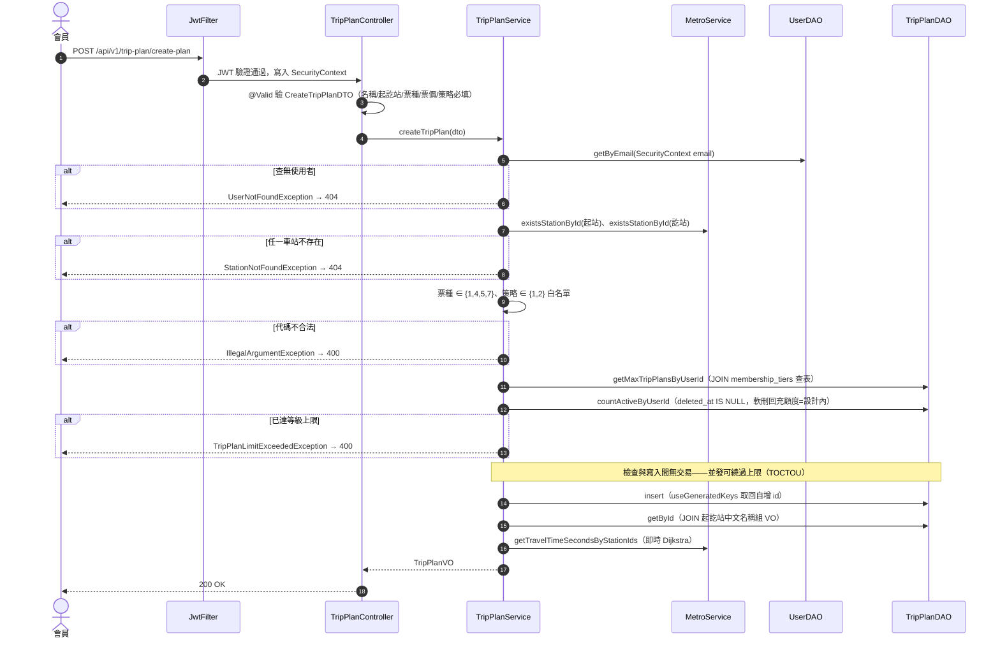
```mermaid
sequenceDiagram
    autonumber
    actor M as 會員
    participant JF as JwtFilter
    participant C as TripPlanController
    participant S as TripPlanService
    participant MS as MetroService
    participant UD as UserDAO
    participant D as TripPlanDAO

    M->>JF: POST /api/v1/trip-plan/create-plan
    JF->>C: JWT 驗證通過，寫入 SecurityContext
    C->>C: @Valid 驗 CreateTripPlanDTO（名稱/起訖站/票種/票價/策略必填）
    C->>S: createTripPlan(dto)
    S->>UD: getByEmail(SecurityContext email)
    alt 查無使用者
        S-->>M: UserNotFoundException → 404
    end
    S->>MS: existsStationById(起站)、existsStationById(訖站)
    alt 任一車站不存在
        S-->>M: StationNotFoundException → 404
    end
    S->>S: 票種 ∈ {1,4,5,7}、策略 ∈ {1,2} 白名單
    alt 代碼不合法
        S-->>M: IllegalArgumentException → 400
    end
    S->>D: getMaxTripPlansByUserId（JOIN membership_tiers 查表）
    S->>D: countActiveByUserId（deleted_at IS NULL，軟刪回充額度=設計內）
    alt 已達等級上限
        S-->>M: TripPlanLimitExceededException → 400
    end
    Note over S,D: 檢查與寫入間無交易——並發可繞過上限（TOCTOU）
    S->>D: insert（useGeneratedKeys 取回自增 id）
    S->>D: getById（JOIN 起訖站中文名稱組 VO）
    S->>MS: getTravelTimeSecondsByStationIds（即時 Dijkstra）
    S-->>C: TripPlanVO
    C-->>M: 200 OK
```

### UC_B 查詢旅程規劃

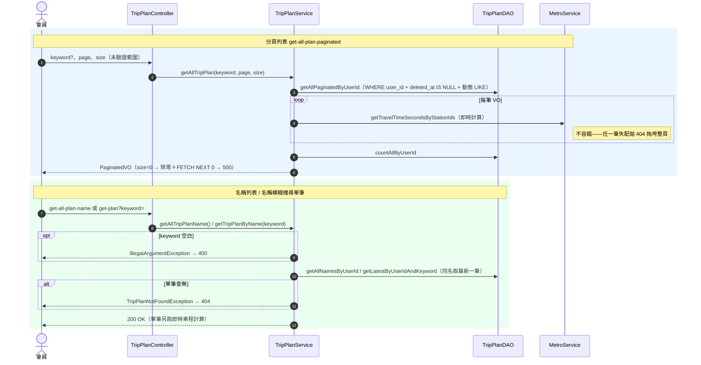
```mermaid
sequenceDiagram
    autonumber
    actor M as 會員
    participant C as TripPlanController
    participant S as TripPlanService
    participant D as TripPlanDAO
    participant MS as MetroService

    rect rgb(235, 245, 255)
    Note over M,MS: 分頁列表 get-all-plan-paginated
    M->>C: keyword?、page、size（未驗證範圍）
    C->>S: getAllTripPlan(keyword, page, size)
    S->>D: getAllPaginatedByUserId（WHERE user_id + deleted_at IS NULL + 動態 LIKE）
    loop 每筆 VO
        S->>MS: getTravelTimeSecondsByStationIds（即時計算）
        Note right of MS: 不容錯——任一筆失配拋 404 拖垮整頁
    end
    S->>D: countAllByUserId
    S-->>M: PaginatedVO（size=0 → 除零＋FETCH NEXT 0 → 500）
    end

    rect rgb(235, 255, 240)
    Note over M,D: 名稱列表 / 名稱模糊搜尋單筆
    M->>C: get-all-plan-name 或 get-plan?keyword=
    C->>S: getAllTripPlanName() / getTripPlanByName(keyword)
    opt keyword 空白
        S-->>M: IllegalArgumentException → 400
    end
    S->>D: getAllNamesByUserId / getLatestByUserIdAndKeyword（同名取最新一筆）
    alt 單筆查無
        S-->>M: TripPlanNotFoundException → 404
    end
    S-->>M: 200 OK（單筆另跑即時車程計算）
    end
```

### UC_C 修改與刪除旅程規劃

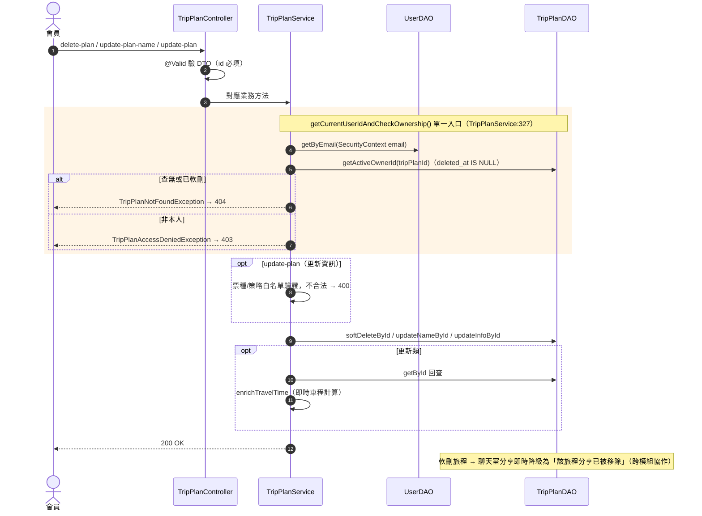
```mermaid
sequenceDiagram
    autonumber
    actor M as 會員
    participant C as TripPlanController
    participant S as TripPlanService
    participant UD as UserDAO
    participant D as TripPlanDAO

    M->>C: delete-plan / update-plan-name / update-plan
    C->>C: @Valid 驗 DTO（id 必填）
    C->>S: 對應業務方法
    rect rgb(255, 245, 230)
    Note over S,D: getCurrentUserIdAndCheckOwnership() 單一入口（TripPlanService:327）
    S->>UD: getByEmail(SecurityContext email)
    S->>D: getActiveOwnerId(tripPlanId)（deleted_at IS NULL）
    alt 查無或已軟刪
        S-->>M: TripPlanNotFoundException → 404
    else 非本人
        S-->>M: TripPlanAccessDeniedException → 403
    end
    end
    opt update-plan（更新資訊）
        S->>S: 票種/策略白名單驗證，不合法 → 400
    end
    S->>D: softDeleteById / updateNameById / updateInfoById
    opt 更新類
        S->>D: getById 回查
        S->>S: enrichTravelTime（即時車程計算）
    end
    S-->>M: 200 OK
    Note over D: 軟刪旅程 → 聊天室分享即時降級為「該旅程分享已被移除」（跨模組協作）
```

### UC_D 匯出旅程規劃 Excel

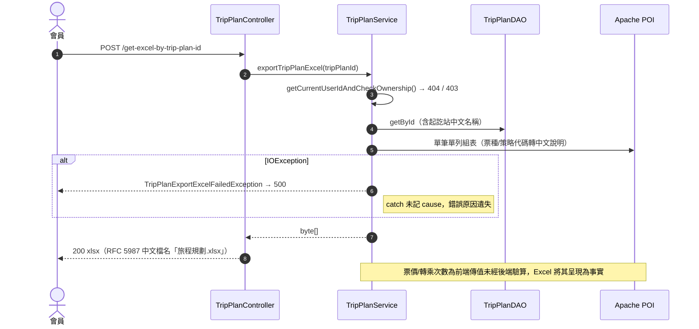
```mermaid
sequenceDiagram
    autonumber
    actor M as 會員
    participant C as TripPlanController
    participant S as TripPlanService
    participant D as TripPlanDAO
    participant POI as Apache POI

    M->>C: POST /get-excel-by-trip-plan-id
    C->>S: exportTripPlanExcel(tripPlanId)
    S->>S: getCurrentUserIdAndCheckOwnership() → 404 / 403
    S->>D: getById（含起訖站中文名稱）
    S->>POI: 單筆單列組表（票種/策略代碼轉中文說明）
    alt IOException
        S-->>M: TripPlanExportExcelFailedException → 500
        Note right of S: catch 未記 cause，錯誤原因遺失
    end
    S-->>C: byte[]
    C-->>M: 200 xlsx（RFC 5987 中文檔名「旅程規劃.xlsx」）
    Note over S,POI: 票價/轉乘次數為前端傳值未經後端驗算，Excel 將其呈現為事實
```

## 3. 重點摘要（給技術主管）

### 新增旅程規劃

本功能提供會員依據起訖站、票種及乘車策略建立個人專屬的捷運規劃，並受會員等級之數量限制。

- **執行流程**：
  - 會員提交旅程參數，後端於 Controller 層做基本非空驗證後調用 `createTripPlan`。
  - Service 依當前身分向 `UserDAO` 獲取 `userId`，若無則拋出 404。
  - 呼叫 `MetroService.existsStationById` 驗證起站與訖站皆存在於資料庫，否則拋出 404。
  - 檢查輸入之票種代碼與策略代碼是否落在白名單內（`{1,4,5,7}` 與 `{1,2}`），否則拋出 `IllegalArgumentException` (400)。
  - 調用 DAO JOIN `membership_tiers` 表撈取當前用戶等級之最大規劃數上限，並統計當前有效規劃數，若已達上限則拋出配額已滿異常 (400)。
  - 驗證均通過後，呼叫 DAO 執行 insert 寫入資料庫並取得自增 id。
  - 依自增 id 重新呼叫 `getById` 撈取 Entity，並進行 VO 轉換與即時車程時間計算後返回。

### 查詢旅程規劃

本功能包含會員對個人所有旅程的分頁列表、簡要列表及特定旅程的名稱模糊檢索。

- **執行流程**：
  - 會員發送查詢參數（分頁或關鍵字），後端自 SecurityContext 取得 Email 並反查 `userId`。
  - 呼叫 DAO 執行查詢，SQL 一律強制加上 `t.user_id = #{userId}` 與 `t.deleted_at IS NULL`，從底層資料範圍實現天然的水平越權防護。
  - 載入結果列表時，對每筆旅程，Service 調用 `MetroService.getTravelTimeSecondsByStationIds` 即時以圖演算法計算車程時間，並將秒數塞入 VO。
  - 若其中任何一站代碼失配，此處之 `enrichTravelTime` 不會進行 try-catch 攔截，而是直接拋出 `StationNotFoundException` (404) 導致整頁查詢失敗。
  - 分頁列表將總筆數與內容組裝為 `PaginatedVO` 返回客戶端。

### 修改與刪除旅程規劃

本功能支援會員對既有旅程規劃進行編輯（改名、更新資訊）與軟刪除。

- **執行流程**：
  - 會員針對特定 `tripPlanId` 發起修改或刪除請求。
  - 服務層收斂至單一入口私有方法 `getCurrentUserIdAndCheckOwnership(tripPlanId)`。
  - 該私有方法自 SecurityContext 提取 Email 查得當前 `userId`，呼叫 DAO `getActiveOwnerId(tripPlanId)` 查詢該旅程的 `user_id`（限定 `deleted_at IS NULL`）。
  - 若旅程不存在或已被刪除，拋出 404；若該旅程之擁有人與當前 `userId` 不符，則拋出 403 Forbidden 進行越權防護。
  - 通過擁有權查核後，修改方法呼叫 DAO 更新名稱或相關欄位。
  - 刪除方法呼叫 DAO 將 `deleted_at` 寫入為當前 UTC 時間戳完成軟刪除，並釋放用戶的旅程配額。
  - 刪除成功後，該旅程若曾被分享至聊天室，聊天室撈取歷史訊息時因 JOIN `deleted_at IS NULL` 失配，會自動以 `CASE WHEN` 降級顯示該分享已移除。

### 匯出旅程規劃 Excel

本功能提供會員將個人規劃的特定旅程匯出為 Excel 工作表。

- **執行流程**：
  - 會員發送匯出請求，經 `getCurrentUserIdAndCheckOwnership` 驗證該旅程為本人所有。
  - 呼叫 DAO 查詢旅程詳細資料（包含起訖站及轉乘點站序）。
  - 調用 Apache POI 建立 Excel 檔，將票種代碼與策略代碼在 Java 層轉譯為對應之中文名稱（例如「單程票」、「最少轉乘」）以利閱讀。
  - 調用 `MetroService` 獲取即時 Dijkstra 算出的車程時間並填入試算表中，將檔案寫入位元組流。
  - 設定 Response Header 進行 RFC 5987 中文檔名編碼處理，返回 `.xlsx` 檔案下載流給會員。
